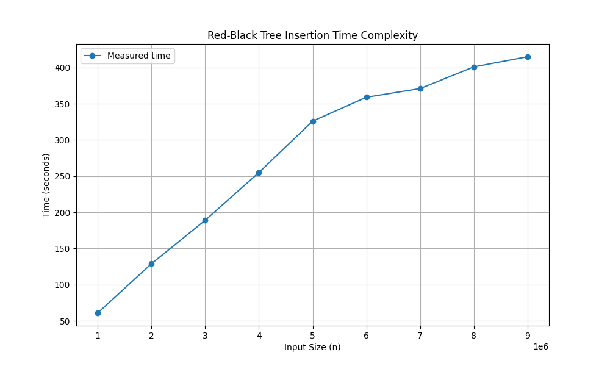
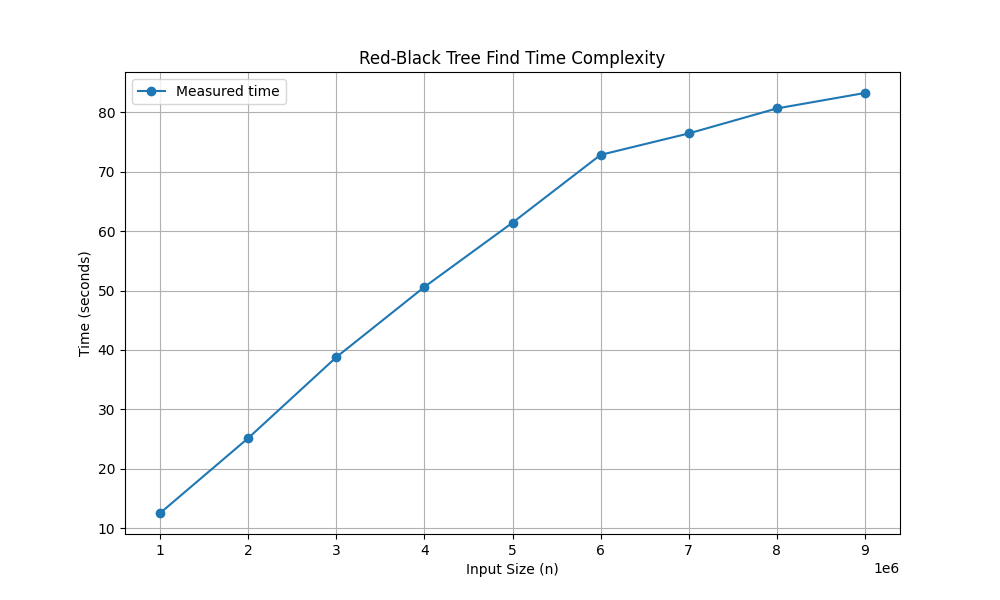

# prjctr-22-profiling

```
python3 -m venv venv
source venv/bin/activate
pip install -r requirements.txt
pytest rbt/test_tree.py -v -s
pytest rbt/test_time.py -v -s
pytest rbt/test_space.py -v -s
```

## Test results

Insertion



Search



Space


